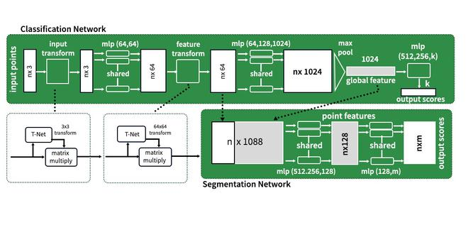
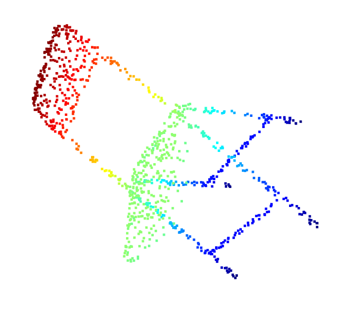

# 🧠 Point Cloud Classification (3D ML)

This project focuses on processing 3D mesh data and converting it into point clouds for object classification using deep learning techniques.

---

## 📌 Overview

* Convert `.off` mesh files → point clouds
* Visualize 3D data using Open3D
* Build a dataset pipeline for training
* Train a deep learning model (PointNet)

### 🪑 Supported Classes

* Chair
* Table
* Sofa
* Bed

---

## 🧠 What is PointNet?

PointNet is a deep learning architecture designed to work directly on **3D point clouds**.

Unlike images, point clouds are:

* Unordered
* Irregular
* Sparse

---

### ⚙️ How PointNet Works

1. Input: A set of 3D points → `(x, y, z)`
2. Apply MLP (Multi-Layer Perceptron) to each point
3. Aggregate features using **Max Pooling**
4. Output → Object class (chair, table, etc.)

---

### 📐 Architecture Overview



---

### 🔑 Key Idea: Order Invariance

Point clouds have **no fixed order**, meaning:

`(p1, p2, p3)` = `(p3, p1, p2)`

PointNet solves this using:

👉 **Max Pooling**

Which extracts the most important features regardless of order.

---

### 📊 Input and Output

* **Input:** `(1024, 3)` → 1024 points
* **Output:** Class label

---

## ⚙️ Tech Stack

* Python 3.10
* PyTorch
* Open3D
* Trimesh
* NumPy
* Matplotlib

---

## 📂 Project Structure

```
Point_Cloud/
│
├── data/                # Dataset (ignored in Git)
├── images/              # Output + architecture images
├── scripts/             # Conversion + dataset loader
├── requirements.txt
└── README.md
```

---

## 🔄 Mesh to Point Cloud

This project converts 3D mesh files (`.off`) into point clouds using sampling techniques.

---

## 📊 Output Visualization

### 🔹 Chair Example



---

## 🚀 How to Run

### 1️⃣ Create Virtual Environment

```
py -3.10 -m venv venv
venv\Scripts\activate
```

### 2️⃣ Install Dependencies

```
pip install -r requirements.txt
```

### 3️⃣ Convert Dataset

```
python scripts/convert_to_pointcloud.py
```

### 4️⃣ Visualize

```
python scripts/visualize.py
```

---

## 🧪 Dataset

* ModelNet10 Dataset
* Contains 3D object categories like chairs, tables, etc.
* Mesh format: `.off`
* Converted to point clouds (`.npy`)

---

## 🎯 Features

* ✅ Mesh → Point Cloud conversion
* ✅ 3D visualization using Open3D
* ✅ Custom PyTorch Dataset Loader
* 🚧 PointNet Model (in progress)

---

## 👨‍💻 Author

**Aditya Paratwar**

---

